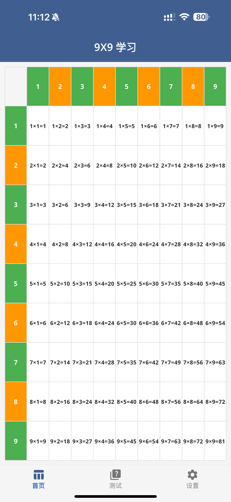
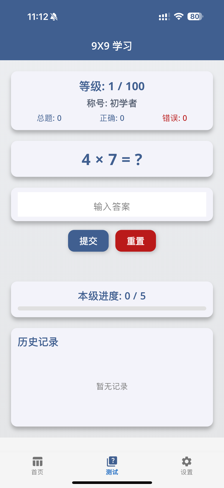
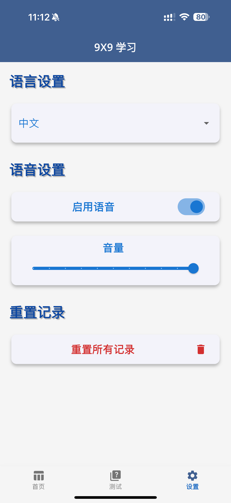

# Multiplication Table App

A Flutter application for practicing and learning the 9×9 multiplication table. Supports both Chinese and English languages, interactive test and challenge modes, and customizable audio feedback.

## Features

* **Multiplication Table Display**: View the full 9×9 multiplication table in a clean, responsive grid.
* **Test Mode**: Quiz yourself with random multiplication questions and track your progress.
* **Challenge Mode**: Advance through progressive levels (关卡/Quests) to earn rewards.
* **Audio Feedback**: Enable TTS audio for each multiplication fact (一一得一…／One times one is one…).
* **Localization**: Switch seamlessly between Chinese (中文) and English (English) UI and audio.
* **Settings**: Control language, enable/disable audio, and adjust volume.
* **Dark Mode**: Follows system theme (light/dark).
* **Responsive Layout**: Supports portrait and landscape orientations.

## Screenshots





## Getting Started

### Prerequisites

* Flutter SDK (>= 3.0)
* Android NDK 27.0.12077973 (specified in `android/app/build.gradle.kts`)
* Supported platforms: Android, iOS

### Installation

1. Clone this repository:

   ```bash
   git clone https://github.com/yourusername/multiplication_table.git
   cd multiplication_table
   ```
2. Install dependencies:

   ```bash
   flutter pub get
   ```
3. Configure Android NDK version in `android/app/build.gradle.kts`:

   ```kotlin
   android {
     ndkVersion = "27.0.12077973"
     // ...
   }
   ```
4. Run the app:

   ```bash
   flutter run
   ```

## Project Structure

```
lib/
├── main.dart         # App entry point and navigation
├── app_configs.dart  # Provider-managed settings (language, audio)
├── home_page.dart    # Displays the 9×9 multiplication grid
├── quiz_page.dart # Progressive level/quiz mode
├── settings_page.dart # Language & audio settings
└── utils.dart        # Helper functions (e.g., number-to-Chinese converter)
```

## Localization

* Language options are provided via a dropdown in Settings.
* App strings (titles, labels) automatically switch between 中/EN.
* Application name configured in Android manifest via resource strings:

  * `res/values/strings.xml` → `9X9 Learn`
  * `res/values-zh/strings.xml` → `9X9 学习`

## Audio Feedback

* Powered by `pyttsx3` scripts (external tooling) to generate MP3 files.
* Chinese audio follows the traditional 口诀 format (一一得一…).
* English audio reads out facts (One times one equals one…).
* Audio files placed under `assets/audio/` and referenced in pubspec.
* Settings allow enabling/disabling audio and adjusting volume.

## Challenge & Test Modes

* **Test Mode**: Presents random questions; immediate feedback.
* **Challenge Mode**: Sequential questions with increasing difficulty; track level completion.
* Bottom navigation bar: icons and labels switch text based on language.

## Customization

* Modify `utils.dart` to adjust number-to-text logic.
* Change TTS generation script for different voices or languages.
* Update theme colors and fonts in `main.dart` under `ThemeData`.

## Contributing

Contributions welcome! Feel free to open issues or pull requests.

## License

This project is licensed under the MIT License.
